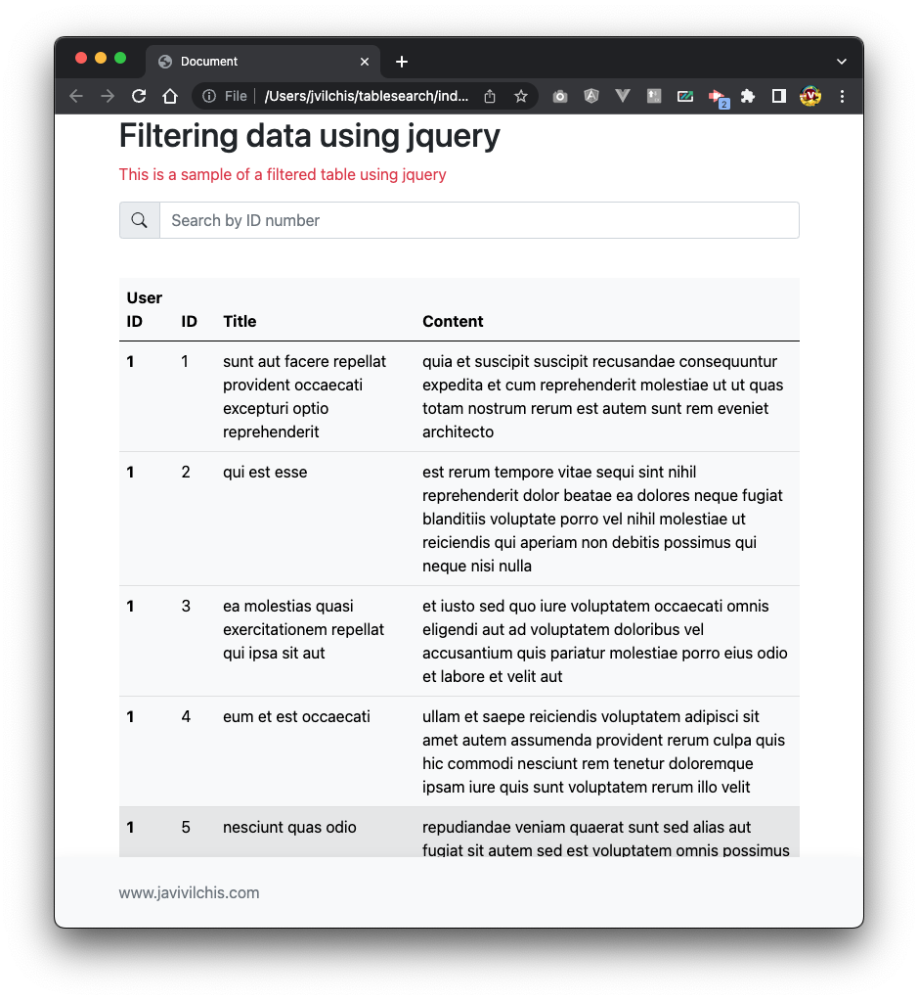

# tablesearch
Table search using jquery and jquery ajax, this sample will get you started on utilizing jquery and jquery ajax to import json data from an public api or from your own api. After, you can filter out the data by typing in a number in the search input area.

## what is the table search
This project will look like this

## how to load this repo
open your terminal or command line and make a clone of this repo. Open the location where you clone the repo and open the index.html in your prefered browser.

## How to contribute to this repo
Please feel free to create a fork and upload anything you wish to have within this repo.

## How to contact 
Feel free to send me an email to <a href="mailto:javivilchis@gmail.com?subject=about tablesearch repo">javivilchis@gmail.com</a> for any questions or concerns you might have baout this repo.

